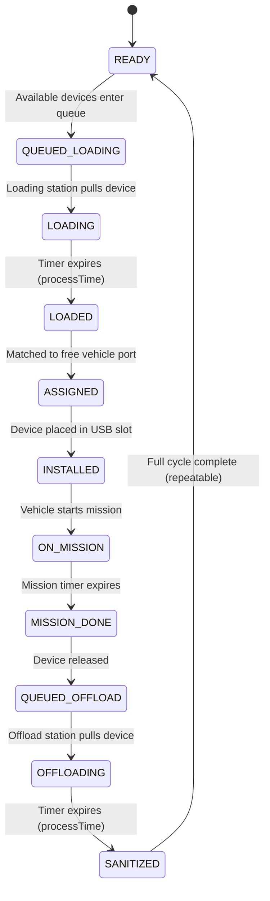

# MSD Ops Simulator v2.0

**Mission Storage Device Operations Simulator**  
A clean, well-documented, state-machine-driven simulation tool for analyzing reusable storage device logistics in vehicle operations (aircraft, ground vehicles, etc.).

This v2.0 version is specifically structured to be **easy for Cursor (or other AI coding agents) to understand, extend, and maintain**.

## Project Goals

- Make the **full operational workflow** visible and interactive.
- Clearly show the impact of the **2-port USB hub constraint** per vehicle.
- Highlight where **loading vs offloading capacity** becomes the real bottleneck.
- Provide decision support for investment choices (more devices vs more stations vs faster process time).

## Architecture Overview (for Cursor)

### Core Concept
This is a **discrete-event style simulator** running on a simple tick-based loop. All state changes are **timer-driven** (not animation-driven) for reliability and repeatability.

### Main Components

| File / Section          | Purpose                                      | Key Cursor Notes |
|-------------------------|----------------------------------------------|------------------|
| `index.html`            | Self-contained simulator + UI                | Main file. All logic is in `<script>`. Well-commented state machine. |
| `README.md`             | Documentation + architecture                 | You are here. Start here when extending. |
| `MSD_Investment_Analysis.xlsx` | Investment trade-off modeling         | Contains baseline + comparison tables. |
| `docs/WORKFLOW.md`      | Detailed state machine explanation           | Best place to understand the 11 states. |
| `docs/WALKTHROUGH.md`   | Operator walkthrough with screenshots        | Start here to run the sim end-to-end. |
| `docs/CAPACITY_ANALYSIS.md` | Poisson / M/M/c sizing formulas          | How many MSDs and stations you need. |
| `docs/ROADMAP.md`       | Phased program plan                          | Sim + analysis alignment roadmap. |
| `analysis/capacity_model.py` | CLI capacity sizing                     | `python -m analysis.capacity_model` |
| `docs/INVESTMENT_FRAMEWORK.md` | When to invest in what                 | Decision framework for leadership. |
| `AGENTS.md`             | Guide for AI coding agents                   | Cursor/agent onboarding. |

### State Machine (The Heart of the System)

The simulator uses a strict, explicit state machine with **11 states**:



**Critical Design Decisions (Cursor should preserve these):**
- Devices only change state when their **timer expires** (not based on visual position).
- Two explicit queues (`loadingQueue` and `offloadQueue`) prevent devices from getting stuck.
- Vehicles can only operate if they have **at least 1 device** installed (enforces real constraint).
- After sanitization, devices immediately return to `READY` to keep the cycle running.

## How the Simulator Works (High-Level Flow)

1. **Every tick**, the simulator:
   - Processes loading stations (timer-based)
   - Processes offload stations (timer-based)
   - Moves `READY` devices into the loading queue
   - Assigns `LOADED` devices to vehicles with free ports
   - Starts missions on vehicles that have devices
   - Ends missions whose timers have expired
   - Moves finished devices into the offload queue

2. **Metrics** are derived live from device states and vehicle status.

3. **Configuration** is driven by sliders (all values live in the `config` object).

## How to Extend This Simulator (Cursor Instructions)

### Adding a New State
1. Add it to the `STATES` constant object.
2. Add handling logic in the appropriate `processXxx()` function or the main tick.
3. Update the state summary renderer if needed.
4. Document it in `docs/WORKFLOW.md`.

### Changing Vehicle Port Limit (currently hardcoded to 2)
- Search for `slots: [null, null]` and `vehicle.slots`.
- The limit is intentionally simple — easy to make configurable later.

### Adding New Metrics or Alerts
- Add calculations in `updateUI()`.
- The event log already captures important state transitions — extend `addLog()` calls.

### Making It Multi-File (Recommended Future Step)
- Extract the state machine into `js/state-machine.js`
- Extract UI rendering into `js/ui.js`
- Keep `index.html` as the thin orchestrator + Tailwind CDN for now (keeps it zero-dependency).

## Running Locally

Just open `index.html` in any browser. No build step required.

**Walkthrough:** [docs/WALKTHROUGH.md](docs/WALKTHROUGH.md) (screenshots in `docs/images/`).

**Capacity sizing:**

```bash
python -m analysis.capacity_model --config fixtures/baseline.yaml
python scripts/sync-config.py    # after editing baseline.yaml
./scripts/run-tests.sh           # includes regression scenarios
python -m analysis.regression    # analysis vs sim alignment
./scripts/export-sensitivity.sh  # CSV sweep for Excel
```

Simulator v2.1 links analysis banner + Apply recommendation to the same formulas as the CLI.

## Issue tracking (beads)

```bash
bd ready    # next unblocked task
bd prime    # full workflow
```

## Investment Analysis Spreadsheet

The Excel file contains two main sheets:

1. **Calculator** (original) – Basic device quantity modeling using peak concurrency + flow.
2. **Investment_Analysis** (new in v2.0) – Side-by-side comparison of the five main investment levers with priority recommendations.

Use the simulator first to discover your bottleneck, then use the spreadsheet to model the investment case.

## Recommended Cursor Workflow

When asked to improve this project:

1. Read `README.md` (this file) first.
2. Read `docs/WORKFLOW.md` to understand the state machine deeply.
3. Look at the `config` object and main tick loop in `index.html`.
4. Make small, well-commented changes.
5. Update the relevant documentation.

## Future Roadmap Ideas (for Cursor)

- Add cost modeling directly in the simulator UI
- Monte Carlo mode (random failures + variable mission times)
- Export current simulation state to the Excel file
- Support different vehicle classes with varying port counts
- Add a simple backend (FastAPI + Vercel) to persist scenarios
- Turn the single HTML into a small SvelteKit app for better maintainability

## License & Attribution

Internal engineering decision-support tool.  
Designed for clarity and extensibility.

---

**This v2.0 version was built to be Cursor-friendly.**  
Clear states. Timer-driven logic. Explicit queues. Good documentation. Minimal magic.