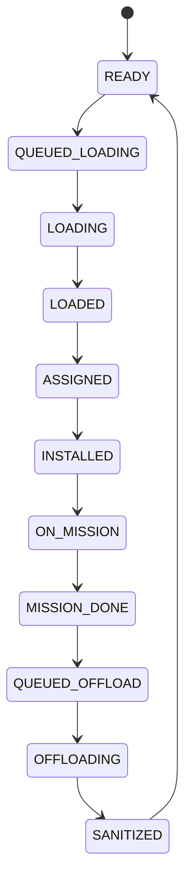

# MSD Ops Simulator

**Mission Storage Device Operations Simulator** — a decision-support tool for reusable storage device logistics in vehicle operations (aircraft, ground vehicles, etc.).

Use the interactive simulator to see bottlenecks, then the capacity model to size MSD pools and loading/offload stations.

## Screenshots

### Configuration and capacity analysis

The v2.1 UI links live sliders to the same M/M/c queueing math as the Python CLI.

| Initial setup | Steady-state run |
|---------------|------------------|
|  |  |

| Offload bottleneck (stress case) | Capacity CLI |
|----------------------------------|--------------|
|  |  |

Full walkthrough: [docs/WALKTHROUGH.md](docs/WALKTHROUGH.md)

## What it does

- Makes the **full MSD operational workflow** visible and interactive.
- Shows the **2-port USB hub constraint** per vehicle.
- Highlights where **loading vs offloading** becomes the bottleneck.
- Supports investment decisions: more devices, more stations, or faster process time.

## State machine

Eleven timer-driven states (see [docs/WORKFLOW.md](docs/WORKFLOW.md)):


```mermaid
stateDiagram-v2
    [*] --> READY
    READY --> QUEUED_LOADING
    QUEUED_LOADING --> LOADING
    LOADING --> LOADED
    LOADED --> ASSIGNED
    ASSIGNED --> INSTALLED
    INSTALLED --> ON_MISSION
    ON_MISSION --> MISSION_DONE
    MISSION_DONE --> QUEUED_OFFLOAD
    QUEUED_OFFLOAD --> OFFLOADING
    OFFLOADING --> SANITIZED
    SANITIZED --> READY
```

## Quick start

**Simulator** — open in any browser, no build step:

```bash
xdg-open index.html
```

**Analysis and tests:**

```bash
python3 -m venv .venv && .venv/bin/pip install -r requirements-dev.txt
python scripts/sync-config.py
./scripts/run-tests.sh
python -m analysis.capacity_model --config fixtures/baseline.yaml
python -m analysis.capacity_model --config fixtures/baseline.yaml --monte-carlo 200
python -m analysis.regression
./scripts/export-sensitivity.sh stations output/sensitivity-stations.csv
python -m analysis.scenario_explorer --config fixtures/sweep_briefing.yaml -o output/sweep.csv
python -m analysis.generate_briefing --config fixtures/baseline.yaml --sweep fixtures/sweep_briefing.yaml \
  -o docs/examples/briefing.html --markdown docs/examples/briefing.md
```

Refresh screenshots: `python scripts/capture-screenshots.py` (requires Playwright).

## Briefings

Self-contained HTML/Markdown for technical discussions:

```bash
python -m analysis.generate_briefing \
  --config fixtures/baseline.yaml \
  --sweep fixtures/sweep_briefing.yaml \
  -o docs/examples/briefing.html
```

Edit `fixtures/baseline.yaml` or `fixtures/sweep_briefing.yaml` to change configuration options, then regenerate. Details: [docs/BRIEFING.md](docs/BRIEFING.md). Example pack: [docs/examples/briefing.html](docs/examples/briefing.html).

## Repository map

| Path | Purpose |
|------|---------|
| `index.html` | Interactive simulator + analysis banner |
| `fixtures/baseline.yaml` | Shared scenario (20 ticks = 1 hour) |
| `fixtures/sweep_briefing.yaml` | Multi-parameter sweep + ranking for briefings |
| `analysis/capacity_model.py` | M/M/c sizing + full-workflow constraints (`--monte-carlo N`) |
| `analysis/scenario_explorer.py` | Grid/LHS sweeps and preferred-scenario ranking |
| `analysis/generate_briefing.py` | HTML/Markdown briefing generator |
| `analysis/reporting.py` | Report rendering helpers |
| `analysis/monte_carlo.py` | Optional offload wait distribution sampler |
| `analysis/regression.py` | Analysis vs sim alignment checks |
| `analysis/sensitivity.py` | CSV investment sweeps |
| `docs/CAPACITY_ANALYSIS.md` | Queueing formulas |
| `docs/BRIEFING.md` | How to produce and refresh briefing artifacts |
| `docs/INVESTMENT_FRAMEWORK.md` | Which lever to pull when constrained |
| `docs/ROADMAP.md` | Program phases |
| `AGENTS.md` | Guide for AI coding agents |

## Investment analysis

Use the simulator to find your bottleneck, then:

```bash
./scripts/export-sensitivity.sh stations output/sensitivity-stations.csv
python -m analysis.scenario_explorer --config fixtures/sweep_briefing.yaml -o output/sweep.csv
```

Open the CSV in Excel or LibreOffice, or open the HTML briefing. See [docs/INVESTMENT_FRAMEWORK.md](docs/INVESTMENT_FRAMEWORK.md).

## Issue tracking

This project uses [beads](https://github.com/gastownhall/beads) (`bd`):

```bash
bd ready
bd prime
```

## License

Internal engineering decision-support tool. See [LICENSE](LICENSE).
