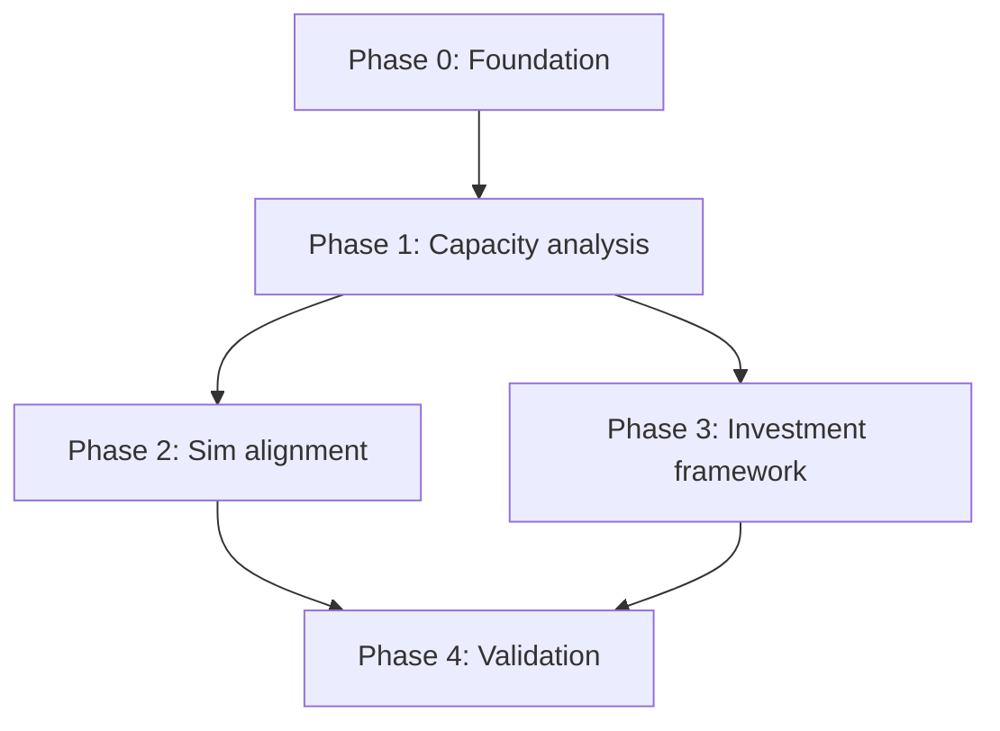

# MSD Ops Simulator — Program Roadmap

## Objective

Extend the existing **timer-driven state-machine simulator** (`index.html`) with a **correct, auditable capacity model** so planners can answer:

> Given **vehicles** and **missions per day**, how many **MSD devices**, **loading stations**, and **offload stations** are required — and where is the bottleneck?

**Principles:** Correct over flashy. Simple formulas. Simulator validates the model; the model sizes the investment.

---

## What exists today (v2.0)

| Asset | Purpose |
|-------|---------|
| `index.html` | Interactive discrete-tick simulator (11-state machine) |
| `docs/WORKFLOW.md` | State machine reference |
| `README.md` | Architecture and Cursor extension notes |

**Gap:** README references `MSD_Investment_Analysis.xlsx` and `docs/INVESTMENT_FRAMEWORK.md` — not yet in repo. Capacity sizing is manual (tweak sliders, watch queues).

---

## Architecture (target)

```text
Inputs (vehicles, missions/day, durations, ports)
        |
        v
analysis/capacity_model.py   <-- Poisson / M/M/c queue math
        |
        +--> Recommended: MSD pool, loading stations, offload stations
        +--> Bottleneck label (loading | offload | devices | vehicles)
        |
        v
index.html simulator          <-- Validate recommendations under same parameters
        |
        v
docs/WALKTHROUGH.md + screenshots
```

The simulator and the analysis module share the same parameter names (`vehicles`, `missions_per_day`, `mission_duration`, `process_time`, `ports_per_vehicle`, station counts, pool size).

---

## Phases

### Phase 0 — Project foundation (this PR)

| # | Deliverable | Exit criteria |
|---|-------------|---------------|
| 0.1 | `AGENTS.md` project guide | Agents know sim + analysis layout |
| 0.2 | Beads epic + phased tasks | `bd ready` shows Phase 1 work |
| 0.3 | `docs/ROADMAP.md` | This document |
| 0.4 | `docs/CAPACITY_ANALYSIS.md` | Formulas documented with worked example |
| 0.5 | `docs/WALKTHROUGH.md` + screenshots | Operator can follow sim without guessing |
| 0.6 | `analysis/capacity_model.py` + tests | CLI prints sizing for a scenario |

### Phase 1 — Capacity analysis (core)

| # | Deliverable | Exit criteria |
|---|-------------|---------------|
| 1.1 | `OpsParameters` Pydantic/dataclass model | Single source of truth for inputs |
| 1.2 | Deterministic flow balance (Little's Law) | `devices_required` from λ × cycle time |
| 1.3 | M/M/c Erlang-C wait for load and offload queues | `P(wait)` and `W_q` at target utilization |
| 1.4 | Bottleneck classifier | Returns `loading`, `offload`, `devices`, or `balanced` |
| 1.5 | `python -m analysis.capacity_model` CLI | JSON + human summary from YAML/flags |
| 1.6 | Unit tests with known numeric fixtures | `./scripts/run-tests.sh` green |

### Phase 2 — Simulator ↔ analysis alignment

| # | Deliverable | Exit criteria |
|---|-------------|---------------|
| 2.1 | Map tick units to hours in shared config | One `fixtures/baseline.yaml` drives both |
| 2.2 | "Apply recommendation" button in sim | Sliders set from analysis output |
| 2.3 | Bottleneck banner in sim UI | Matches analysis label at steady state |
| 2.4 | Export run metrics (JSON) | Queue depths + missions/hour for regression |

### Phase 3 — Investment framework

| # | Deliverable | Exit criteria |
|---|-------------|---------------|
| 3.1 | `docs/INVESTMENT_FRAMEWORK.md` | Five levers with decision rules |
| 3.2 | Sensitivity tables (devices vs stations vs process time) | Markdown tables from analysis script |
| 3.3 | Optional CSV export (replaces missing xlsx for now) | Leadership can open in Excel |

### Phase 4 — Validation & polish

| # | Deliverable | Exit criteria |
|---|-------------|---------------|
| 4.1 | Monte Carlo mission arrivals (optional flag) | Distribution of queue depth, not just mean |
| 4.2 | Regression: analysis prediction vs sim steady-state | Within agreed tolerance (e.g. 10%) |
| 4.3 | README update | Quickstart covers sim + analysis + walkthrough |

---

## Dependency graph



---

## Beads tracking

```bash
bd ready                              # next unblocked task
bd show msd-ops-simulator-<id>        # phase detail
```

Epic: **MSD Ops — capacity analysis & walkthrough** (see `.beads/msd-ops-plan.json`).

---

## Acceptance criteria (program)

- Given vehicles + missions/day, analysis returns defensible device and station counts with bottleneck label.
- Formulas are documented; no hidden magic in the UI.
- Simulator can be used to sanity-check the recommendation.
- Walkthrough with screenshots lets a new user run the sim in under 5 minutes.
